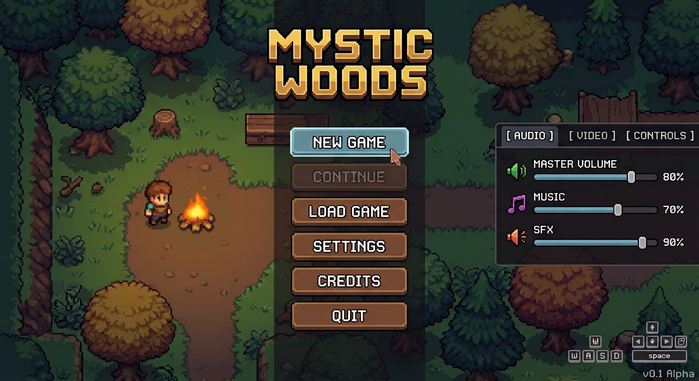

# Mystic Woods - Päävalikon Toteutus (Godot 4)

Tämä dokumentti ohjeistaa, miten luodaan ja strukturoidaan klassinen top-down-pelin päävalikko Godot 4 -pelimoottorilla käyttäen Pixel Art -tyyliä.

---

## 1. Miltä valikko näyttää



Valikossa on:

- Vasemmalla staattinen taustakuva pelistä (tai dynaaminen pelinäkymä).
- Keskellä pelin logo ja pystysuoraan järjestetyt pääpainikkeet.
- Oikealla puoliläpinäkyvä asetusvalikko (Audio / Video / Controls).
- Oikeassa alakulmassa ohjain/näppäimistövinkit sekä versiomerkintä (`v0.1 Alpha`).

---

## 2. Solmurakenne (Node Hierarchy)

Rakenna päävalikkokohtaus (`MainMenu.tscn`) seuraavan solmupuun mukaisesti:

```text
MainMenu (Control)
│
├── Background (TextureRect)  <-- Taustakuva (tai Camera2D / SubViewportContainer)
│
├── MainUI (PanelContainer)  <-- Taustaväri, koko määräytyy sisällön mukaan (voidaan listätä myös MarginContainer)
│   │
│   └── MenuCenter (VBoxContainer)  <-- Keskittää logon ja napit pystysuunnassa
│       │
│       ├── TitleLabel (Label)  <-- Pelin otsikko "MYSTIC WOODS"
│       │
│       └── ButtonContainer (VBoxContainer)  <-- Päävalikon napit
│           ├── StartButton (Button) <-- Peli alkaa
│           ├── ContinueButton (Button)
│           ├── LoadButton (Button)
│           ├── SettingsButton (Button) <-- Näyttää SettingsPanelin
│           ├── CreditsButton (Button)
│           └── QuitButton (Button) <-- Poistu pelistä
│
├── SettingsPanel (PanelContainer)  <-- Oikeassa reunassa oleva asetusikkuna
│    └── TabContainer
│        ├── AudioTab (VBoxContainer)
│        │   ├── MasterVolSlider (HSlider)
│        │   ├── MusicVolSlider (HSlider)
│        │   └── SFXVolSlider (HSlider)
│        ├── VideoTab (VBoxContainer)
│        └── ControlsTab (VBoxContainer)
│
├── BottomRightLayout (VBoxContainer)  <-- Ankkuroitu oikeaan alakulmaan (Bottom-Right)
│   │
│   ├── InputPrompts (HBoxContainer)  <-- Ohjain/näppäimistövinkit (Tapa 1)
│   │   ├── NavKeyIcon (TextureRect)   <-- WASD -kuva
│   │   ├── SelectKeyIcon (TextureRect)<-- Nuolet -kuva
│   │
│   └── VersionLabel (Label)  <-- "v0.1 Alpha"
```
